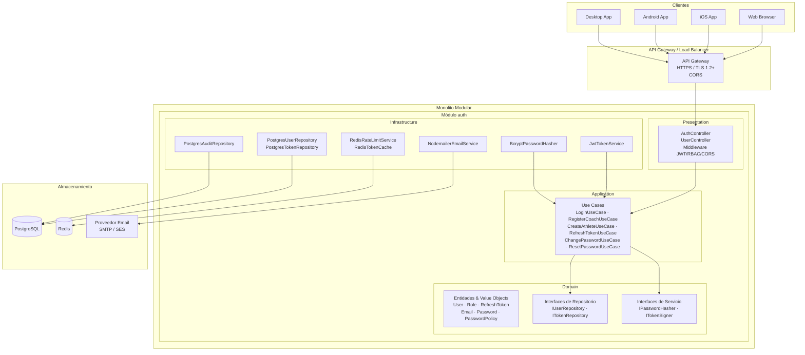
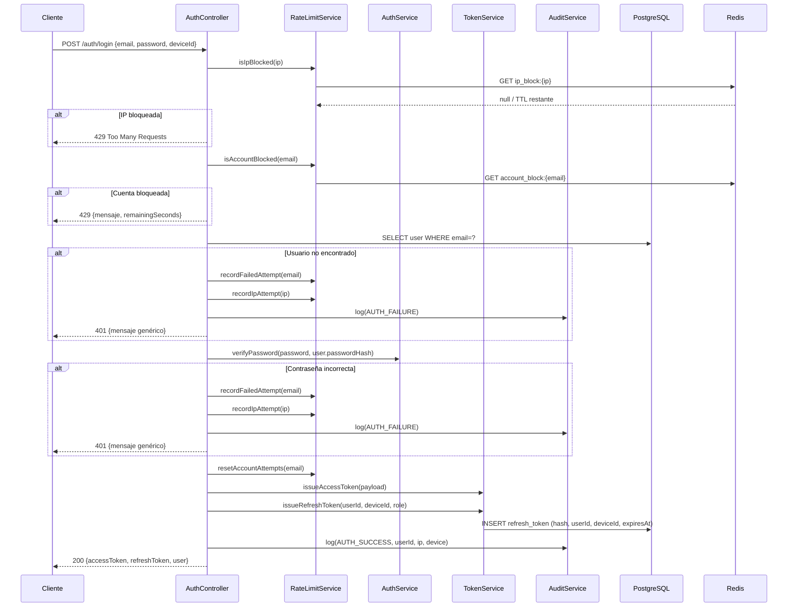
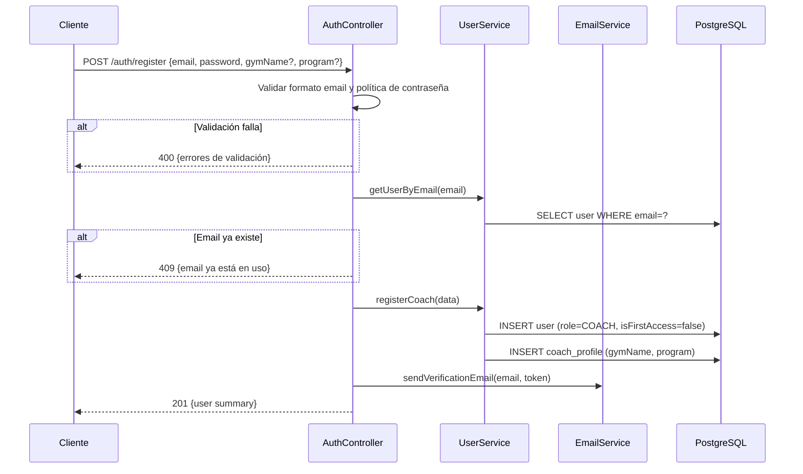
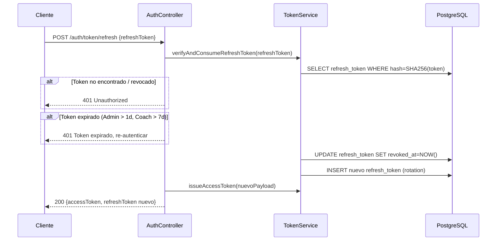

# Diseño Técnico: Sistema de Autenticación y Login de Usuarios

## Resumen General

El sistema de autenticación y login gestiona el ciclo de vida completo de identidad para una aplicación multiplataforma con tres roles jerarquizados: Administrador, Entrenador y Atleta. Expone una API REST consumida por clientes web, iOS, Android y desktop.

Las responsabilidades principales son:

- Registro y creación de cuentas según la jerarquía de roles
- Autenticación basada en credenciales con emisión de tokens JWT
- Gestión del ciclo de vida de sesiones (access token + refresh token)
- Verificación de email
- Recuperación y cambio de contraseña
- Control de acceso basado en roles (RBAC)
- Protección contra ataques de fuerza bruta (por cuenta e IP)
- Auditoría de eventos de seguridad

---

## Arquitectura

### Patrón Estructural: Monolito Modular con Clean Architecture

El sistema se construye como un **Monolito Modular**: un único proceso desplegable que se divide internamente en módulos con límites explícitos. Dentro de cada módulo se aplica **Clean Architecture** (también conocida como Arquitectura Hexagonal o Puertos y Adaptadores), organizando el código en capas con una regla de dependencia estricta: **las dependencias solo fluyen hacia adentro**, desde la infraestructura hasta el dominio.

```
Presentation  →  Application  →  Domain
Infrastructure →  Application  →  Domain
```

- **Domain**: el núcleo puro. Sin dependencias externas. Contiene entidades, value objects, interfaces de repositorios y reglas de negocio.
- **Application**: orquesta casos de uso. Conoce las interfaces del dominio pero no sus implementaciones concretas.
- **Infrastructure**: implementa las interfaces definidas en Domain y Application. Es intercambiable.
- **Presentation**: controllers HTTP, middleware, DTOs de entrada/salida, mapeo de errores a HTTP.

Este diseño no es únicamente una decisión técnica de organización interna — es la base que permite que el sistema **evolucione hacia microservicios o arquitectura orientada a eventos** sin reescribir la lógica de negocio.

### Visión de Alto Nivel



### Estructura de Directorios

```
src/
  modules/
    auth/
      domain/
        entities/           # User, RefreshToken, EmailVerificationToken, PasswordResetToken
        value-objects/      # Email, Password, Role
        repositories/       # IUserRepository, ITokenRepository (interfaces puras)
        services/           # IPasswordHasher, ITokenSigner (interfaces puras)
        events/             # UserRegistered, PasswordChanged, AccountLocked (tipos, sin bus aún)
      application/
        use-cases/          # LoginUseCase, RegisterCoachUseCase, CreateAthleteUseCase,
                            # CreateUserByAdminUseCase, RefreshTokenUseCase,
                            # ChangePasswordUseCase, ResetPasswordUseCase,
                            # VerifyEmailUseCase, RevokeSessionsUseCase
        ports/              # IEmailService, IRateLimitService, IAuditService (interfaces)
        dtos/               # DTOs internos de la capa de aplicación
      infrastructure/
        persistence/        # PostgresUserRepository, PostgresTokenRepository,
                            # PostgresAuditRepository, migrations/
        cache/              # RedisRateLimitService, RedisTokenCache
        email/              # NodemailerEmailService
        security/           # JwtTokenService, BcryptPasswordHasher
      presentation/
        controllers/        # AuthController, UserController
        middleware/         # AuthMiddleware (JWT), RoleGuard, CorsMiddleware
        dtos/               # Request/Response DTOs HTTP (LoginRequest, AuthResponse, etc.)
        mappers/            # Mapeo entre DTOs HTTP y DTOs de aplicación
  shared/
    domain/                 # Tipos compartidos, errores de dominio base (DomainError, etc.)
    infrastructure/         # Config, logger, conexión DB, módulo de DI
  main.ts                   # Punto de entrada: composición de dependencias (Composition Root)
```

> **Regla de módulos**: cada módulo expone únicamente su API pública a través de un archivo `index.ts` en la raíz del módulo. El resto del monolito solo puede importar desde ese índice — nunca desde subcarpetas internas de otro módulo. Esto garantiza que los límites del módulo son respetados y facilita la extracción futura a un proceso separado.

### Decisiones de Arquitectura

| Decisión | Elección | Justificación |
|---|---|---|
| Protocolo de transporte | HTTPS / TLS 1.2+ | Requerimiento 11.5 y 12.5 |
| Formato de tokens | JWT (RS256) | Stateless, verificable sin DB en la mayoría de casos |
| Hash de contraseñas | bcrypt, factor 12 | Requerimiento 12.3 |
| Almacenamiento de refresh tokens | PostgreSQL + Redis | Persistencia + revocación rápida |
| Bloqueo de cuentas | Redis con TTL | Eficiencia y expiración automática |
| Bloqueo por IP | Redis con TTL | Requerimiento 12.4 |
| API estilo | REST | Requerimiento 11.1 |
| Multi-dispositivo | Un refresh token por dispositivo | Requerimiento 8.6 |
| **Patrón estructural** | **Monolito Modular** | Facilita extracción futura a microservicios o arquitectura orientada a eventos sin reescribir lógica de negocio |
| **Patrón interno** | **Clean Architecture (Dependency Rule)** | La lógica de dominio y casos de uso no dependen de frameworks, bases de datos ni protocolos de transporte; son completamente portables |
| **Eventos de dominio** | **Síncronos inicialmente; preparados para bus asíncrono** | `UserRegistered`, `PasswordChanged`, `AccountLocked` se definen como tipos en la capa de dominio. Hoy se manejan síncronamente; migrar a RabbitMQ o Kafka solo requiere cambiar la infraestructura del bus, sin tocar el dominio |
| **Inyección de dependencias** | **Composición en `main.ts` (Composition Root)** | Las dependencias concretas (PostgresUserRepository, JwtTokenService, etc.) se instancian y cablean únicamente en el punto de entrada; los casos de uso nunca conocen las implementaciones concretas |

### Principios de la Regla de Dependencia

Los casos de uso (capa Application) no conocen ni HTTP ni la base de datos concreta. Únicamente conocen las interfaces definidas en Domain y en los puertos de Application. Esto tiene consecuencias prácticas directas:

1. **La infraestructura es intercambiable**: cambiar de PostgreSQL a otro motor, o de SMTP a SES, únicamente requiere cambiar una implementación en `infrastructure/` — sin tocar ningún caso de uso ni entidad de dominio.

2. **Los tests son rápidos y aislados**: los casos de uso pueden testearse completamente en memoria, sin base de datos ni servicios externos, usando implementaciones in-memory de las interfaces.

3. **La extracción a microservicio es incremental**: cuando un módulo debe convertirse en un proceso independiente, el caso de uso ya está aislado. Solo hay que envolver la capa Presentation en un nuevo proceso y reemplazar las llamadas síncronas entre módulos por mensajes (HTTP, gRPC o eventos en un bus).

---

## Componentes e Interfaces

### AuthController

Capa de presentación REST. Valida entradas y delega lógica a servicios internos.

```
POST /auth/register                 → Registro público de Entrenador
POST /auth/login                    → Autenticación con credenciales
POST /auth/logout                   → Cierre de sesión
POST /auth/token/refresh            → Refresco de access token
POST /auth/password/change          → Cambio de contraseña (autenticado)
POST /auth/password/forgot          → Solicitud de recuperación de contraseña
POST /auth/password/reset           → Aplicar nueva contraseña con token de recuperación
GET  /auth/email/verify/:token      → Verificar email con enlace
POST /auth/email/resend-verification → Reenviar email de verificación

POST /users                         → Crear usuario (Admin/Entrenador, según rol)
PATCH /users/:id/role               → Modificar rol de usuario (solo Admin)
DELETE /auth/sessions               → Revocar todas las sesiones del usuario actual
```

Todos los endpoints protegidos requieren el header `Authorization: Bearer <access_token>`.  
Para clientes web se soporta adicionalmente cookie HTTP-only `__Secure-refresh_token`.

### AuthService (Autenticador)

Responsable de verificar identidades y emitir tokens.

```typescript
interface AuthService {
  login(email: string, password: string, deviceInfo: DeviceInfo): Promise<AuthResult>
  logout(userId: string, deviceId: string): Promise<void>
  refreshAccessToken(refreshToken: string): Promise<AccessTokenResult>
  revokeAllSessions(userId: string): Promise<void>
}
```

### UserService (Gestor de Usuarios)

Responsable de crear, activar y administrar cuentas.

```typescript
interface UserService {
  registerCoach(data: CoachRegistrationData): Promise<User>
  createUserByAdmin(data: AdminCreateUserData, adminId: string): Promise<User>
  createAthleteByCoach(data: CoachCreateAthleteData, coachId: string): Promise<User>
  getUserById(userId: string): Promise<User>
  getUserByEmail(email: string): Promise<User | null>
}
```

### RoleService (Gestor de Roles)

Responsable de asignar, validar y gestionar roles.

```typescript
interface RoleService {
  assignRole(targetUserId: string, newRole: Role, requesterId: string): Promise<void>
  validatePermission(userId: string, requiredRole: Role): Promise<boolean>
  canCreateRole(requesterRole: Role, targetRole: Role): boolean
}
```

### TokenService (Gestor de Tokens)

Responsable de emitir, validar y revocar tokens JWT.

```typescript
interface TokenService {
  issueAccessToken(payload: TokenPayload): string
  issueRefreshToken(userId: string, deviceId: string, role: Role): Promise<RefreshTokenRecord>
  verifyAccessToken(token: string): TokenPayload
  verifyAndConsumeRefreshToken(token: string): Promise<RefreshTokenRecord>
  revokeRefreshToken(tokenId: string): Promise<void>
  revokeAllUserRefreshTokens(userId: string): Promise<void>
}
```

### EmailService (Servicio de Email)

```typescript
interface EmailService {
  sendVerificationEmail(to: string, verificationToken: string): Promise<void>
  sendCredentialsEmail(to: string, credentials: { email: string; password: string }): Promise<void>
  sendPasswordResetEmail(to: string, resetToken: string): Promise<void>
}
```

### RateLimitService

```typescript
interface RateLimitService {
  recordFailedAttempt(accountKey: string): Promise<void>
  isAccountBlocked(accountKey: string): Promise<{ blocked: boolean; remainingSeconds?: number }>
  recordIpAttempt(ip: string): Promise<void>
  isIpBlocked(ip: string): Promise<{ blocked: boolean; remainingSeconds?: number }>
  resetAccountAttempts(accountKey: string): Promise<void>
}
```

### AuditService (Servicio de Auditoría)

```typescript
interface AuditService {
  log(event: AuditEvent): Promise<void>
}

type AuditEventType =
  | 'AUTH_SUCCESS'
  | 'AUTH_FAILURE'
  | 'LOGOUT'
  | 'PASSWORD_CHANGE'
  | 'PASSWORD_RESET'
  | 'ACCOUNT_CREATED'
  | 'ROLE_CHANGED'
  | 'ACCOUNT_LOCKED'
  | 'EMAIL_VERIFIED'
```

---

## Modelos de Datos

### Entidad: User

```sql
CREATE TABLE users (
    id              UUID PRIMARY KEY DEFAULT gen_random_uuid(),
    email           VARCHAR(255) UNIQUE NOT NULL,
    password_hash   VARCHAR(72) NOT NULL,          -- bcrypt output
    role            VARCHAR(20) NOT NULL CHECK (role IN ('ADMIN', 'COACH', 'ATHLETE')),
    email_verified  BOOLEAN NOT NULL DEFAULT FALSE,
    is_first_access BOOLEAN NOT NULL DEFAULT FALSE, -- solo relevante para ATHLETE
    created_by      UUID REFERENCES users(id),      -- quién creó esta cuenta
    created_at      TIMESTAMPTZ NOT NULL DEFAULT NOW(),
    updated_at      TIMESTAMPTZ NOT NULL DEFAULT NOW()
);
```

### Entidad: CoachProfile

```sql
CREATE TABLE coach_profiles (
    id          UUID PRIMARY KEY DEFAULT gen_random_uuid(),
    user_id     UUID UNIQUE NOT NULL REFERENCES users(id) ON DELETE CASCADE,
    gym_name    VARCHAR(255),
    program     VARCHAR(255),
    created_at  TIMESTAMPTZ NOT NULL DEFAULT NOW(),
    updated_at  TIMESTAMPTZ NOT NULL DEFAULT NOW()
);
```

### Entidad: RefreshToken

```sql
CREATE TABLE refresh_tokens (
    id          UUID PRIMARY KEY DEFAULT gen_random_uuid(),
    user_id     UUID NOT NULL REFERENCES users(id) ON DELETE CASCADE,
    token_hash  VARCHAR(64) NOT NULL,               -- SHA-256 del token real
    device_id   VARCHAR(255) NOT NULL,
    device_info JSONB,
    role        VARCHAR(20) NOT NULL,
    issued_at   TIMESTAMPTZ NOT NULL DEFAULT NOW(),
    expires_at  TIMESTAMPTZ,                        -- NULL para Atleta (sin expiración por tiempo)
    revoked_at  TIMESTAMPTZ,
    UNIQUE (user_id, device_id)
);

CREATE INDEX idx_refresh_tokens_user ON refresh_tokens(user_id);
CREATE INDEX idx_refresh_tokens_hash ON refresh_tokens(token_hash);
```

### Entidad: EmailVerificationToken

```sql
CREATE TABLE email_verification_tokens (
    id          UUID PRIMARY KEY DEFAULT gen_random_uuid(),
    user_id     UUID NOT NULL REFERENCES users(id) ON DELETE CASCADE,
    token_hash  VARCHAR(64) NOT NULL UNIQUE,
    issued_at   TIMESTAMPTZ NOT NULL DEFAULT NOW(),
    expires_at  TIMESTAMPTZ NOT NULL DEFAULT NOW() + INTERVAL '24 hours',
    used_at     TIMESTAMPTZ
);
```

### Entidad: PasswordResetToken

```sql
CREATE TABLE password_reset_tokens (
    id          UUID PRIMARY KEY DEFAULT gen_random_uuid(),
    user_id     UUID NOT NULL REFERENCES users(id) ON DELETE CASCADE,
    token_hash  VARCHAR(64) NOT NULL UNIQUE,
    issued_at   TIMESTAMPTZ NOT NULL DEFAULT NOW(),
    expires_at  TIMESTAMPTZ NOT NULL DEFAULT NOW() + INTERVAL '1 hour',
    used_at     TIMESTAMPTZ
);
```

### Entidad: AuditLog

```sql
CREATE TABLE audit_logs (
    id           UUID PRIMARY KEY DEFAULT gen_random_uuid(),
    user_id      UUID REFERENCES users(id),
    event_type   VARCHAR(30) NOT NULL,
    occurred_at  TIMESTAMPTZ NOT NULL DEFAULT NOW(),
    ip_address   INET NOT NULL,
    device_info  JSONB,
    metadata     JSONB                               -- datos adicionales del evento
);

CREATE INDEX idx_audit_user_id ON audit_logs(user_id);
CREATE INDEX idx_audit_occurred_at ON audit_logs(occurred_at DESC);
```

### Tipos de Transferencia (DTOs)

```typescript
// Entrada
interface LoginRequest {
  email: string
  password: string
  deviceId: string
  deviceType: 'WEB' | 'IOS' | 'ANDROID' | 'DESKTOP'
}

interface CoachRegistrationData {
  email: string
  password: string
  gymName?: string
  program?: string
}

interface AdminCreateUserData {
  email: string
  password: string
  role: 'ADMIN' | 'COACH'
}

interface CoachCreateAthleteData {
  email: string
  password: string
}

// Salida
interface AuthResult {
  accessToken: string            // JWT, expira en 15 min
  refreshToken: string           // opaco, almacenado en cookie o retornado en body
  expiresIn: number              // 900 (segundos)
  tokenType: 'Bearer'
  user: UserSummary
}

interface UserSummary {
  id: string
  email: string
  role: Role
  emailVerified: boolean
  isFirstAccess: boolean
}

interface TokenPayload {          // claims dentro del JWT
  sub: string                    // userId
  role: Role
  email: string
  emailVerified: boolean
  iat: number
  exp: number
  jti: string                    // token ID único
}
```

---

## Flujos Principales

### Flujo de Autenticación (Login)



### Flujo de Registro Público (Entrenador)



### Flujo de Refresco de Token



---

## Mecanismo de Bloqueo por Fuerza Bruta

### Bloqueo de cuenta (Requerimiento 4.5)

- Clave Redis: `account_fail:{email}` → contador con TTL deslizante de 10 minutos
- Al alcanzar 5 intentos fallidos: `account_block:{email}` con TTL = 900 s (15 min)
- En cada intento mientras bloqueado: responder con tiempo restante

### Bloqueo por IP (Requerimiento 12.4)

- Clave Redis: `ip_fail:{ip}` → contador con TTL deslizante de 5 minutos
- Al alcanzar 20 intentos: `ip_block:{ip}` con TTL = 1800 s (30 min)

### Duración de Refresh Tokens por Rol

| Rol | Duración Refresh Token | expires_at en DB |
|---|---|---|
| ADMIN | 1 día | NOW() + 1 day |
| COACH | 7 días | NOW() + 7 days |
| ATHLETE | Sin expiración | NULL |

---

## Validación de Contraseñas

Función de validación centralizada usada en registro, creación de cuentas y cambio de contraseña:

```typescript
interface PasswordValidationResult {
  valid: boolean
  errors: string[]
}

function validatePassword(password: string): PasswordValidationResult {
  const errors: string[] = []
  if (password.length < 8)           errors.push('Mínimo 8 caracteres')
  if (!/[A-Z]/.test(password))       errors.push('Al menos una letra mayúscula')
  if (!/[a-z]/.test(password))       errors.push('Al menos una letra minúscula')
  if (!/[0-9]/.test(password))       errors.push('Al menos un dígito numérico')
  if (!/[^A-Za-z0-9]/.test(password)) errors.push('Al menos un carácter especial')
  return { valid: errors.length === 0, errors }
}
```

---

## Manejo de Errores

### Catálogo de Errores HTTP

| Código | Escenario |
|---|---|
| 400 Bad Request | Datos de entrada inválidos (validación de contraseña, formato email) |
| 401 Unauthorized | Credenciales incorrectas, token expirado/inválido |
| 403 Forbidden | Intento de operación no permitida para el rol |
| 404 Not Found | Recurso no encontrado |
| 409 Conflict | Email ya en uso |
| 422 Unprocessable Entity | Regla de negocio violada (enlace ya utilizado, etc.) |
| 429 Too Many Requests | Bloqueo por fuerza bruta (cuenta o IP) |
| 500 Internal Server Error | Error inesperado del servidor |

### Principios de Seguridad en Errores

- Los mensajes de error de autenticación NO revelan si el email existe o cuál campo es incorrecto (Requerimiento 4.4).
- La recuperación de contraseña retorna respuesta genérica independientemente de si el email existe (Requerimiento 10.2).
- Los errores 500 loguean el stack completo internamente pero exponen solo un ID de correlación al cliente.

### Formato de Respuesta de Error

```json
{
  "error": {
    "code": "INVALID_CREDENTIALS",
    "message": "Email o contraseña incorrectos.",
    "correlationId": "uuid-de-la-request"
  }
}
```

---

## Estrategia de Testing

### Pruebas Unitarias

Se prueban de forma aislada (con mocks de dependencias):

- `validatePassword`: todos los criterios de seguridad y combinaciones
- `TokenService`: emisión, verificación, expiración y revocación de tokens
- `RateLimitService`: conteo de intentos fallidos, activación de bloqueo, TTL
- `AuthService.login`: rutas feliz y de error
- Lógica de permisos de roles en `RoleService.canCreateRole`

### Pruebas Basadas en Propiedades (PBT)

Se usará una librería de PBT del ecosistema del lenguaje objetivo (p.ej. `fast-check` para TypeScript). Cada prueba corre mínimo 100 iteraciones. Las propiedades formales se detallan en la sección siguiente.

Etiqueta de referencia por prueba: `Feature: user-authentication-login, Property N: <texto>`

### Pruebas de Integración

- Flujo completo de registro → verificación de email → login
- Flujo completo de recuperación de contraseña
- Comportamiento de bloqueo por fuerza bruta con Redis real
- Creación de cuentas por Administrador y Entrenador
- Refresco y rotación de tokens

### Pruebas de Seguridad (manuales / herramientas)

- Verificar que las contraseñas se almacenan como hash bcrypt (nunca en plano)
- Verificar que los tokens de verificación/recuperación usados no son reutilizables
- Verificar respuestas HTTPS únicamente
- Verificar encabezados CORS correctos


---

## Propiedades de Corrección

*Una propiedad es una característica o comportamiento que debe mantenerse verdadero en todas las ejecuciones válidas del sistema — esencialmente, una declaración formal sobre lo que el sistema debe hacer. Las propiedades sirven como puente entre las especificaciones legibles por humanos y las garantías de corrección verificables por máquinas.*

---

### Propiedad 1: Validación de contraseña es exhaustiva y coherente

*Para cualquier* cadena de texto como contraseña, la función de validación debe retornar `valid=true` si y solo si cumple **todos** los criterios: longitud mínima de 8 caracteres, al menos una letra mayúscula, al menos una letra minúscula, al menos un dígito numérico y al menos un carácter especial. Cuando retorna `valid=false`, la lista de errores debe contener exactamente los criterios incumplidos.

**Valida: Requerimientos 1.3, 2.2, 3.2, 4.8, 4.9, 6.2, 7.4, 10.5**

---

### Propiedad 2: La creación de cuenta asigna exactamente el rol solicitado

*Para cualquier* combinación de datos válidos de creación de cuenta (email único, contraseña válida, rol permitido según el tipo de operación), la cuenta creada debe tener asignado exactamente el rol que se indicó y debe estar activa.

**Valida: Requerimientos 1.6, 2.5**

---

### Propiedad 3: Los permisos de creación de cuenta respetan la jerarquía de roles

*Para cualquier* usuario solicitante y rol objetivo, la operación de creación debe ser permitida o rechazada según la tabla de permisos:
- ADMIN puede crear ADMIN y COACH
- COACH puede crear ATHLETE únicamente
- ATHLETE no puede crear ningún rol
- El registro público solo puede crear COACH

Cualquier intento fuera de estas reglas debe retornar HTTP 403.

**Valida: Requerimientos 1.1, 1.2, 1.7, 2.7, 3.1, 3.7**

---

### Propiedad 4: La cuenta de Atleta creada por Entrenador tiene Primer_Acceso activado

*Para cualquier* cuenta de Atleta creada por un Entrenador, la cuenta recién creada debe tener el indicador `isFirstAccess = true` y el rol `ATHLETE`.

**Valida: Requerimiento 3.4**

---

### Propiedad 5: La duración del refresh token es coherente con el rol del usuario

*Para cualquier* login exitoso, la duración del refresh token emitido debe corresponder exactamente al rol del usuario autenticado:
- ATHLETE → sin fecha de expiración (`expires_at = NULL`)
- COACH → expira exactamente a los 7 días desde la emisión
- ADMIN → expira exactamente a 1 día desde la emisión

El access token debe expirar en 15 minutos independientemente del rol.

**Valida: Requerimientos 4.1, 4.2, 4.3**

---

### Propiedad 6: El mensaje de error de credenciales incorrectas no revela qué campo falló

*Para cualquier* intento de login con email incorrecto y cualquier intento de login con contraseña incorrecta (para un email existente), el mensaje de error retornado debe ser textualmente idéntico. El código de respuesta HTTP debe ser 401 en ambos casos.

**Valida: Requerimiento 4.4**

---

### Propiedad 7: El bloqueo de cuenta por intentos fallidos se activa y respeta correctamente

*Para cualquier* cuenta, después de exactamente 5 intentos de autenticación fallidos consecutivos dentro de una ventana de 10 minutos:
- La cuenta debe quedar bloqueada durante 15 minutos
- Cualquier intento adicional mientras el bloqueo está activo debe retornar HTTP 429 con el tiempo restante de bloqueo
- Después del bloqueo, la cuenta debe ser accesible con credenciales correctas

**Valida: Requerimientos 4.5, 4.6**

---

### Propiedad 8: El log de auditoría contiene todos los campos requeridos para cada evento

*Para cualquier* evento de seguridad (autenticación exitosa, autenticación fallida, cierre de sesión, cambio de contraseña, creación de cuenta, cambio de rol), el registro en `audit_logs` debe contener obligatoriamente: `user_id`, `event_type`, `occurred_at` (en UTC), `ip_address` y `device_info`.

**Valida: Requerimientos 4.7, 12.1, 12.2**

---

### Propiedad 9: El perfil de entrenador acepta cualquier combinación de campos opcionales

*Para cualquier* combinación de datos opcionales del `Perfil_de_Entrenador` (gymName presente, program presente, ambos presentes, ninguno presente), el proceso de Registro_Público debe completarse exitosamente.

**Valida: Requerimiento 2.3**

---

### Propiedad 10: Un token de verificación de email solo puede usarse una vez

*Para cualquier* token de verificación de email válido, al ser utilizado una primera vez el email queda marcado como verificado (`emailVerified = true`). Cualquier intento posterior de usar ese mismo token debe retornar error indicando que el enlace ya fue utilizado.

**Valida: Requerimientos 5.4, 5.5**

---

### Propiedad 11: Los tokens de verificación y recuperación expirados son rechazados

*Para cualquier* token de verificación de email con `expires_at` en el pasado (> 24 horas desde emisión), o token de recuperación de contraseña con `expires_at` en el pasado (> 1 hora desde emisión), el sistema debe rechazar su uso e indicar que el enlace expiró.

**Valida: Requerimientos 5.7, 10.3**

---

### Propiedad 12: El reenvío de verificación invalida el token anterior

*Para cualquier* usuario con un token de verificación previo (usado o no expirado), al solicitar el reenvío del email de verificación, el token anterior debe quedar invalidado y el nuevo token debe ser el único válido.

**Valida: Requerimiento 5.8**

---

### Propiedad 13: Cambiar la contraseña revoca todos los refresh tokens activos

*Para cualquier* usuario con N ≥ 0 refresh tokens activos (en cualquier número de dispositivos), tras un cambio de contraseña exitoso (ya sea por cambio voluntario, reset por recuperación, o cambio de Primer_Acceso), todos sus refresh tokens deben quedar revocados. El conteo de tokens activos después del cambio debe ser 0.

**Valida: Requerimientos 6.4, 7.5, 10.4**

---

### Propiedad 14: Cambiar la contraseña de un Atleta elimina el indicador de Primer_Acceso

*Para cualquier* Atleta con `isFirstAccess = true`, tras establecer una nueva contraseña válida exitosamente, el indicador `isFirstAccess` debe ser `false`.

**Valida: Requerimiento 6.3**

---

### Propiedad 15: La verificación de contraseña actual es obligatoria antes de un cambio

*Para cualquier* usuario autenticado, si se proporciona una contraseña actual incorrecta en la solicitud de cambio de contraseña, la operación debe ser rechazada con un mensaje de error genérico y la contraseña no debe ser modificada.

**Valida: Requerimientos 7.2, 7.3**

---

### Propiedad 16: El refresco de token respeta el estado y expiración del refresh token

*Para cualquier* refresh token, el sistema debe emitir un nuevo access token si y solo si el token no está revocado Y no ha superado su duración según el rol (1 día para ADMIN, 7 días para COACH, sin límite temporal para ATHLETE). Cualquier token revocado o expirado debe resultar en HTTP 401.

**Valida: Requerimientos 8.1, 8.2, 8.3, 8.4**

---

### Propiedad 17: El cierre de sesión revoca exactamente el token del dispositivo actual

*Para cualquier* usuario con sesiones activas en múltiples dispositivos, al cerrar sesión desde un dispositivo específico, únicamente el refresh token de ese dispositivo debe ser revocado. Los tokens de los demás dispositivos deben permanecer activos.

**Valida: Requerimientos 8.5, 8.6**

---

### Propiedad 18: La revocación total de sesiones invalida todos los refresh tokens

*Para cualquier* usuario con N ≥ 1 refresh tokens activos en múltiples dispositivos, al solicitar la revocación total de sesiones, todos sus refresh tokens deben quedar revocados. El conteo de tokens activos debe ser 0.

**Valida: Requerimiento 8.7**

---

### Propiedad 19: Solo los roles válidos del sistema son aceptados

*Para cualquier* valor de rol proporcionado que no pertenezca al conjunto `{ADMIN, COACH, ATHLETE}`, el sistema debe rechazar la operación retornando un error de validación.

**Valida: Requerimiento 9.1**

---

### Propiedad 20: Solo los Administradores pueden modificar roles

*Para cualquier* usuario con rol COACH o ATHLETE que intente modificar el rol de cualquier otro usuario, la operación debe ser rechazada con HTTP 403.

**Valida: Requerimientos 9.4, 9.5**

---

### Propiedad 21: La respuesta de recuperación de contraseña es indistinguible para emails registrados y no registrados

*Para cualquier* par de emails donde uno está registrado en el sistema y otro no lo está, la respuesta HTTP de la solicitud de recuperación de contraseña debe ser textualmente idéntica (mismo código de estado, mismo cuerpo de respuesta).

**Valida: Requerimiento 10.2**

---

### Propiedad 22: Las contraseñas se almacenan exclusivamente como hash bcrypt con factor ≥ 12

*Para cualquier* contraseña creada o actualizada en el sistema, el valor almacenado en `password_hash` debe ser un hash bcrypt válido con un cost factor mínimo de 12. Nunca debe almacenarse la contraseña en texto plano.

**Valida: Requerimiento 12.3**

---

### Propiedad 23: El bloqueo por IP se activa tras 20 intentos fallidos en 5 minutos

*Para cualquier* dirección IP desde la que se realicen 20 o más intentos de autenticación fallidos en una ventana de 5 minutos, las solicitudes de autenticación provenientes de esa IP deben ser bloqueadas durante 30 minutos retornando HTTP 429.

**Valida: Requerimiento 12.4**

---

### Propiedad 24: Los headers CORS están presentes en todas las respuestas de autenticación

*Para cualquier* solicitud a los endpoints de autenticación, la respuesta debe incluir los encabezados CORS correctamente configurados para los dominios permitidos.

**Valida: Requerimiento 11.3**
